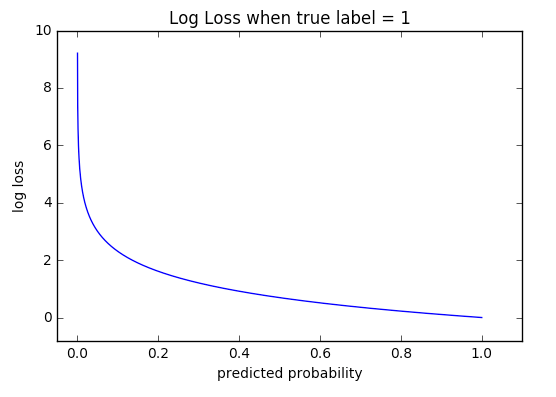

## Cơ chế tối ưu hóa sai số phân loại qua hàm Cross Entropy

### 1. Khái niệm
Trong các bài toán phân loại (Classification), mục tiêu của mô hình không phải là dự đoán một giá trị số học, mà là ước lượng một **phân phối xác suất** để xác định dữ liệu thuộc về lớp nào.

**Cross Entropy Loss** (hay Log Loss) là thước đo định lượng sự khác biệt giữa hai phân phối xác suất:
1.  **Phân phối thực tế ($y$):** Nhãn đúng của dữ liệu (thường là tuyệt đối, ví dụ: 100% là mèo, 0% là chó).
2.  **Phân phối dự đoán ($\hat{y}$):** Đầu ra của mô hình sau khi đi qua hàm kích hoạt (Softmax hoặc Sigmoid), thể hiện độ tin cậy của mô hình đối với từng lớp.

Giá trị Cross Entropy càng thấp, phân phối dự đoán càng tiệm cận với phân phối thực tế, đồng nghĩa với việc độ chính xác của mô hình càng cao.

### 2. Ý nghĩa về mặt toán học
Xét bài toán phân loại đa lớp với $C$ lớp dữ liệu, hàm Loss được xác định bởi công thức tổng quát:

$$L_{CE} = - \sum_{i=1}^{C} y_i \cdot \log(\hat{y}_i)$$

**Các thành phần:**
* $y_i$: Nhãn thực tế dưới dạng **One-hot vector**. Tại vị trí lớp đúng, $y_i = 1$, các vị trí còn lại $y_i = 0$.
* $\hat{y}_i$: Xác suất dự đoán cho lớp thứ $i$.
* $\log$: Logarithm tự nhiên.

Do tính chất của One-hot vector (các phần tử sai đều bằng 0), công thức thực tế khi tính toán cho một mẫu dữ liệu chỉ tập trung vào xác suất của lớp đúng ($y_{target} = 1$):

$$L = - \log(\hat{y}_{target})$$

Điều này có nghĩa là việc tối ưu hóa Cross Entropy chính là bài toán cực đại hóa Log-likelihood của lớp đúng.

### 3. Diễn giải
Cơ chế cốt lõi của Cross Entropy dựa trên sự trừng phạt sai số thông qua hàm Logarithm ($-\log(x)$).

* **Khi mô hình dự đoán đúng và tự tin:** Nếu xác suất dự đoán cho lớp đúng $\hat{y} \approx 1$, thì $-\log(1) = 0$. Loss xấp xỉ bằng 0, mô hình không bị phạt.
* **Khi mô hình dự đoán sai hoặc thiếu tự tin:** Nếu xác suất dự đoán cho lớp đúng $\hat{y} \rightarrow 0$, thì $-\log(\hat{y}) \rightarrow +\infty$. Giá trị Loss tăng vọt.

    <figure>
        
        <figcaption>Hình minh họa: Khi xác suất (trục hoành) tiến về 0, giá trị Loss (trục tung) tiến về vô cực.</figcaption>
    </figure>

Biểu đồ hàm $-\log(x)$ cho thấy độ dốc (gradient) rất lớn khi $x$ gần 0. Điều này khiến cho giá trị đạo hàm rất cao, giúp thuật toán Gradient Descent điều chỉnh trọng số nhanh chóng khi mô hình đang dự đoán sai lệch quá nhiều. Ngược lại, khi dự đoán đã khá chính xác, độ dốc giảm dần giúp mô hình hội tụ ổn định.

### 4. Lưu ý khi triển khai
Khi triển khai và sử dụng Cross Entropy, cần chú ý các điểm kỹ thuật sau để đảm bảo tính ổn định:

* **So sánh với MSE:** 
* **Vấn đề log(0):** Hàm log không xác định tại 0. Trong thực tế lập trình, cần cộng thêm một giá trị cực nhỏ $\epsilon$ (ví dụ $1e^{-6}$) vào $\hat{y}$ để tránh lỗi tính toán (`NaN`).
* **Kết hợp hàm kích hoạt:**
    * Với bài toán nhị phân (2 lớp): Sử dụng **Binary Cross Entropy** kết hợp với đầu ra **Sigmoid**.
    * Với bài toán đa lớp (>2 lớp): Sử dụng **Cross Entropy** kết hợp với đầu ra **Softmax**.
