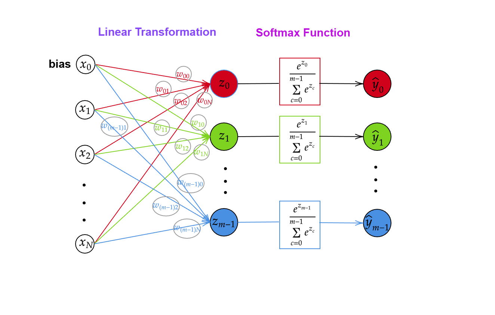

Giới thiệu về Softmax Regression và các hàm loss cho bài toán phân loại đa nhãn

# I. Vấn đề của bài toán

Trong các bài toán phân loại nhị phân kinh điển, chẳng hạn như phân biệt *spam / không spam* hay *bệnh / không bệnh*, mô hình **logistic** tỏ ra đặc biệt hiệu quả. Hàm *sigmoid* nhận một giá trị logit và biến nó thành xác suất thuộc lớp “1”, trong khi xác suất thuộc lớp “0” chỉ đơn giản là phần bù còn lại. Cách biểu diễn này vừa trực quan, vừa phù hợp với trực giác xác suất, nên logistic nhanh chóng trở thành lựa chọn mặc định cho rất nhiều bài toán thực tế khi chỉ có hai lớp cần phân biệt.


Tuy nhiên, khi chuyển sang các bài toán phân loại nhiều lớp – chẳng hạn mô hình cần phân biệt giữa *mèo, chó, chim, cá* – việc “cố gắng” sử dụng lại logistic theo cách truyền thống bắt đầu bộc lộ nhiều hạn chế. Một phương pháp thường gặp là huấn luyện nhiều bộ phân loại nhị phân theo chiến lược *one-vs-rest*, trong đó mỗi mô hình đảm nhận nhiệm vụ dự đoán “mèo hay không mèo”, “chó hay không chó”,… Từ đó, mỗi lớp tạo ra một giá trị xác suất riêng biệt. Vấn đề nằm ở chỗ các xác suất này **không có bất kỳ ràng buộc nào với nhau**: tổng có thể lớn hơn 1, nhiều lớp có thể cùng nhận giá trị rất cao, và mô hình không thật sự bị buộc phải lựa chọn một lớp nổi trội nhất. Điều này khiến việc diễn giải kết quả trở nên thiếu nhất quán: một giá trị xác suất cao không còn đại diện rõ ràng cho khả năng “lớp này tốt nhất” khi đặt trong bối cảnh cạnh tranh giữa toàn bộ các lớp. Kết quả cuối cùng dễ rơi vào tình trạng mơ hồ và thiếu tính xác suất với bài toán đa lớp.

Chính từ những vấn đề đó thì có một cơ chế vừa tổng quát hóa được logistic, vừa ép toàn bộ dự đoán nằm trên một phân phối xác suất với sự cạnh tranh rõ ràng giữa các lớp, hàm softmax được ra đời. Softmax cho phép biến toàn bộ vector logit thành một phân phối xác suất chuẩn hóa trên K lớp, qua đó khắc phục các nhược điểm của các mô hình logistic trước đây và đặt nền tảng cho các kiến trúc phân loại đa lớp hiện đại trong học máy và deep learning.

# Hồi quy Softmax (Softmax Regression)

## 2.1. Ý tưởng chính
- Hồi quy softmax (softmax regression) tổng quát hóa mô hình hồi quy logistic (logistic regression) để tối ưu hóa lời giải cho các bài toán phân loại đa lớp. Thay vì sử dụng hàm sigmoid như trong hồi quy logistic, mô hình hồi quy softmax biến các điểm số thô (hay còn gọi là điểm logit) thành một phân phối xác suất rõ ràng trên tất cả các lớp. 

- *Vậy các điểm số thô / điểm logit này đến từ đâu?* Như trong hồi quy logistic, điểm logit là một kết quả của 1 tổ hợp có trọng số của các đặc trưng đầu vào với hệ số nghiêng (bias). Mỗi logit trong hồi quy softmax biểu diễn mức độ ảnh hưởng của các đặc trưng (features) lên một lớp/nhãn (class/label) cụ thể cho từng mẫu (sample). 
 
- *Tại sao một logit chỉ ảnh hưởng tới một mẫu nhất định?* Hồi quy logistic chỉ có một bộ tham số duy nhất, nên mỗi mẫu chỉ có một logit để tạo ra chính xác một xác suất. Trong khi đó, mỗi lớp trong hồi quy softmax có riêng một bộ tham số để tính toán một điểm sô thô cho chính nó, từ đó hình thành phân phối xác suất trên nhiều lớp.

- *Hàm softmax đóng vai trò gì trong mô hình này?* Hàm softmax nhận điểm số thô để cho ra xác suất của các lớp sao cho tổng của tất cả xác suất trên một mẫu bằng $1$. Những xác suất này mô tả sự tin tưởng của mô hình dành cho từng lớp. Lớp được dự đoán chính là lớp có xác suất lớn nhất. 

## 2.2. Công thức
Cho một tập hợp điểm dữ liệu với $N$ đặc trưng và $m$ lớp. Chúng ta sẽ vectơ hóa dữ liệu đầu vào và đầu ra để thuận tiện ký hiệu, tính toán, và lập trình. 


### 2.2.1. Điểm số thô - Logits
Ta cơ bản đã hiểu ý tưởng của các điểm số thô và vai trò của chúng trong hồi quy softmax. *Vậy logits được thực sự đưa vào mô hình như thế nào?* Chúng ta sẽ cùng xây biểu thức toán học cho logits theo từng bước cụ thể như sau. 

- **Một mẫu, một lớp:** 

    Với $j \in \{1, \cdots, N\}$ và $i \in \{0, \cdots, m - 1\}$, ta có 
    - $x^{(k)}_j$ là đặc trưng đầu vào thứ $j$ của mẫu $k$,
    - $w_{ij}$ là tham số đặc trưng thứ $j$ cửa lớp $i$,
    - $w_{i0}$ là hệ số nghiêng của lớp $i$,
    - $\mathbf{x}^{(k)} = \begin{pmatrix} 1 \\ x^{(k)}_1 \\ \cdots \\ x^{(k)}_n \end{pmatrix} \in \mathbb{R}^{n+1}$ là vectơ đầu vào kèm hệ số nghiêng của mẫu $k$, 
    - $\mathbf{\theta}_i = \begin{pmatrix} w_{i0} \\ w_{i1} \\ \cdots \\ w_{in} \end{pmatrix} \in \mathbb{R}^{n+1}$ là vectơ tham số kèm hệ số nghiêng của lớp $i$, và
    - $z^{(k)}_i$ là logit của lớp $i$.

    Phương trình tuyến tính biến vectơ mẫu $\mathbf{x}^{(k)}$ thành một logit của lớp $i$ như sau

    $$
    z^{(k)}_i = w_{i1} x^{(k)}_1 + \cdots + w_{in} x^{(k)}_n + w_{i0} = \sum_{j=0}^{n} w_{ij}x^{(k)}_j = \mathbf{\theta}_i^T \mathbf{x}^{(k)}.
    $$

- **Một mẫu, $m$ lớp:** 
    
    Ta sẽ sử dụng lại vectơ mẫu $\mathbf{x}^{(k)} \in \mathbb{R}^{n+1}$ ở trên. Với mẫu này, ta cần một vectơ lưu trữ các logits của tất cả các lớp và một ma trận lưu trữ các bộ trọng số. Như vậy, ta có
    
    - $\mathbf{z}^{(k)} \in \mathbb{R}^{m \times 1}$ là vectơ logit trong đó mỗi thành phần là $z^{(k)}_i$, và
    - $\Theta \in \mathbb{R}^{(n+1) \times m}$ là ma trận trọng số có hệ số nghiêng trong đó mỗi cột là $\mathbf{\theta}_i$. 

    Khi đó, các điểm số thô cho tất cả các lớp của mẫu này là

    $$
    \mathbf{z}^{(k)} = \Theta^T \mathbf{x}^{(k)}.
    $$

- **$K$ mẫu, $m$ lớp:**

    Ta sẽ sử dụng lại ma trận trọng số $\Theta \in \mathbb{R}^{(n+1) \times m}$. Ngoài ra, ta cần một ma trận lưu trữ các mẫu và một ma trận khác lưu trữ logits tương ứng. Ta có

    - $X \in \mathbb{R}^{K \times (n+1)}$ là ma trận mẫu trong đó mỗi dòng biểu diễn một mẫu $\mathbf{x}^{(k)} \in \mathbb{R}^{n+1}$, và 
    - $Z \in \mathbb{R}^{K \times m}$ là ma trận logit trong đó mỗi thành phần là logit của mẫu và lớp tương ứng.

    Khi đó, ma trận logit cho $K$ mẫu và $m$ lớp là

    $$
    Z = X \Theta.
    $$

### 2.2.2. Softmax Function
- *Tại sao chỉ dựa vào logit thôi là chưa đủ?* Mặc dù các điểm số thô phản ánh mức độ ảnh hưởng của các đặc trưng đầu vào lên một lớp cụ thể nhưng chúng không thể hiện được mối tương quan giữa các lớp với nhau. Do đó, ta cần biến các logit thành xác suất để đạt được mục đích ban đầu. 

- *Tại sao cần hàm softmax?* Các logit là các số thực, có thể âm, dương, hoặc bằng $0$. Tuy nhiên, số âm không thể tự biểu thị được một xác suất theo cách thông thường. Chính vì thế, ta nên dùng hàm softmax để đảm bảo tính không âm. Hàm softmax có thể biến điểm số thô thành các xác suất có ý nghĩa với tổng bằng $1$. Kết quả thể hiện độ mạnh của lớp tương ứng so với các lớp khác.

- **Hàm softmax:**
    $$
    softmax(z) = \frac{e^z}{\sum_c e^{z_c}}
    $$
- **Hàm softmax trong hồi quy softmax:**
    Cho mẫu $\mathbf{x}^{(k)}$ với vectơ logit $\mathbf{z}^{(k)}$, hàm softmax tính xác suất của lớp $i$ như sau  

    $$
    \displaystyle \hat{y_i}^{(k)} = p(y=i | \mathbf{z}^{(k)}) = \frac{e^{{z^{(k)}_i}}}{\sum_{c=0}^{m-1}e^{z^{(k)}_c}}.
    $$

    Công thức này thỏa mãn các yêu cầu:  
    - tất cả các xác suất đều không âm nhờ hàm mũ,
    - tổng của tất cả các xác suất cho một mẫu bằng $1$, và 
    - xác suất và logit tỉ lệ thuận với nhau.

- **Ví dụ:**
    Xét một mẫu với điểm số thô $\mathbf{z} = \begin{pmatrix} z_0 \\ z_1 \\ z_2 \end{pmatrix} = \begin{pmatrix} 2.0 \\ 1.0 \\ 0.1 \end{pmatrix}$. Áp dụng hàm mũ cho mỗi logit, ta có 
    
    $$
    e^{2.0} = 7.3891, \quad e^{1.0} = 2.7183, \quad e^{0.1} = 1.1052,
    $$
    và
    $$
    \sum_{c = 0}^{2} e^{z_c} = e^{2.0} + e^{1.0} + e^{0.1} = 7.3891 + 2.7183 + 1.1052 = 11.2126.
    $$

    Xác suất của lớp $0$ được dự đoán là 

    $$
    \hat{y_0} = p(y = 0 | \mathbf{z}) = \frac{e^{2.0}}{\sum_{c = 0}^{2} e^{z_c}} = \frac{7.3891}{11.2126} \approx 0.6590.
    $$

    Tính tương tự, ta có vectơ xuất cho lớp $i$ là 

    $$
    \hat{y} = \begin{pmatrix} \hat{y_0} \\ \hat{y_1} \\ \hat{y_2} \end{pmatrix} \approx \begin{pmatrix} 0.6590 \\ 0.2424 \\ 0.0986 \end{pmatrix}
    $$

## 2.3. Quy trình huấn luyện mô hình hồi quy softmax
Mục tiêu của mô hình hồi quy softmax là điều chỉnh tham số sao cho xác suất được dự đoán chính xác nhất có thể. 

- **Forward propagation:**
    - Bước 1: Tính logit bằng phép biến đổi tuyến tính.
    - Bước 2: Áp dụng hàm softmax để chuyển logit thành phân phối xác suất. Lớp có xác suất cao nhất là lớp dự đoán.

- **Backward propagation:** (chi tiết ở phần sau)
    - Bước 3: Tính hàm mất mát (cross-entropy loss) để kiểm tra độ hợp giữa nhãn dự đoán và nhãn thật.
    - Bước 4: Tính đạo hàm (gradient) giúp xác định các tham số cần thay đổi như thế nào để giảm hàm mất mát.
    - Bước 5: Cập nhật tham số bằng gradient descent.

Ta lặp lại quá trình này cho các epoch tới khi hàm mất mát hội tụ và dự đoán ổn định và chính xác.

## 2.4. Ghi chú
Trước khi kết thúc phần này, hãy cùng điểm lại một vài lưu ý quan trọng về mô hình hồi quy softmax.

### 2.4.1. Ưu điểm
- Mô hình dễ hiểu và dễ diễn giải kết quả.
- Mô hình được triển khai và huấn luyện hiệu quả.
- Hàm hàm mất mát là hàm lồi (convex) nên đảm bảo tìm được cực tiểu toàn cục (the global minimum) mà không gặp vấn đề về cục tiểu cục bộ (local minima).

### 2.4.2. Nhược điểm
- **Tràn số:**
    Khi logit quá lớn, số mũ $e^{z_i}$ có thể vượt quá giá trị lớn nhất mà kiểu dữ liệu có thể chứa được. Nếu không được giải quyết triệt để thì có thể dẫn đến tình trạng sai số. Để tránh tình trạng này, ta có thể giới hạn số mũ bằng $m = \underset{j}{max} z_i$ mà vẫn giữ nguyên kết quả. Vậy, ta có

    $$
    \hat{y_i} = \frac{e^{z_i-m}}{\sum_c e^{z_c-m}}
    $$

    Ta thấy trừ đi một hằng số trên mũ (logits) không làm thay đổi kết quả của hàm softmax vì $e^m$ bị khử trong phân số. 

- **Quan hệ phi tuyến:**
    Hồi quy softmax là mô hình một tầng/lớp với hàm giả thuyết là phép biến đổi tuyến tính. Tính chất này khiến cho mô hình nhạy cảm với các ngoại lệ (outliers) cũng như khó xử lý mối quan hệ phi tuyến tính một cách hiệu quả. Để giải quyết vấn đề này, ta cần có dạng mạng nhiều tầng như Multilayer Perceptron (MLP).


<!-- 
# 2. Softmax Regression 

## 2.1. Main Idea
- Softmax Regression, which handles multi-class classification problems, is a generalization of logistic regression. Instead of using the sigmoid function, softmax regression employs the softmax function to turn raw scores into an explicit probability distribution across all classes. 

- *Where do these raw scores (also known as logits) come from?* Like in logistic regression, a logit results from a linear combination which is a weighted sum of input features and a bias. Each of them in softmax regression represents the features' influence on a particular class. 

- *Why does one logit only support a specific class?* In logistic regression, each sample produces just one probability as there is only one score derived from a single set of parameters. In contrast, each class in softmax regression has its own set of parameters to create one raw score thereby generate a probability distribution over multiple classes. 

- *How does the softmax function contribute to the model?* A raw score is fed to the softmax function to compute probabilities over all the classes for one sample. Such probabilities sum to $1$, which describes how strongly the model favors one class over the rest. Thus, the predicted class is simply the one with the highest probability within this distribution.

## 2.2. Formula
Consider a dataset of $N$ features and $m$ classes. For mathematical convenience and more efficient computation, we'll vectorize input and output.

<figure>
    
    <figcaption>Forward propagation with raw scores/logits and softmax function in Softmax Regression</figcaption>
</figure>

### 2.2.1. Raw Scores (Logits)
- We understand the idea of raw scores and their contribution to softmax regression. The question now is how these logits technically fit into the model. Let's formalize the mathematical defintion of logits.

- **One sample, one particular class:** 

    For $j \in \{1, \cdots, N\}$ and $i \in \{0, \cdots, m - 1\}$, let 
    - $x^{(k)}_j$ be the $k^{th}$ sample's $j^{th}$ input feature,
    - $w_{ij}$ be the $j^{th}$ feature's parameter for class $i$,
    - $w_{i0}$ be the bias term for class $i$,
    - $\mathbf{x}^{(k)} = \begin{pmatrix} 1 \\ x^{(k)}_1 \\ \cdots \\ x^{(k)}_n \end{pmatrix} \in \mathbb{R}^{n+1}$ be the $k^{th}$ sample's input vector with bias included, 
    - $\mathbf{\theta}_i = \begin{pmatrix} w_{i0} \\ w_{i1} \\ \cdots \\ w_{in} \end{pmatrix} \in \mathbb{R}^{n+1}$ be the weight-with-bias vector for class $i$, and
    - $z^{(k)}_i$ be the raw score (logit) for class $i$.

    A linear equation transforms the sample vector $\mathbf{x}^{(k)}$ into one raw score (logit) for class $i$ as follows.

    $$
    z^{(k)}_i = w_{i1} x^{(k)}_1 + \cdots + w_{in} x^{(k)}_n + w_{i0} = \sum_{j=0}^{n} w_{ij}x^{(k)}_j = \mathbf{\theta}_i^T \mathbf{x}^{(k)}.
    $$

- **One sample, $m$ classes:** 
    
    We'll use the same sample vector $\mathbf{x}^{(k)} \in \mathbb{R}^{n+1}$ as above. We'll introduce a vector for storing logits for all classes and a matrix for storing all sets of parameters. Consider
    
    - $\mathbf{z}^{(k)} \in \mathbb{R}^{m \times 1}$ is the logit vector where each entry is $z^{(k)}_i$, and
    - $\Theta \in \mathbb{R}^{(n+1) \times m}$ is the weight-with-bias matrix where each column is $\mathbf{\theta}_i$. 

    The logits for all classes are then given by

    $$
    \mathbf{z}^{(k)} = \Theta^T \mathbf{x}^{(k)}.
    $$

- **$K$ samples, $m$ classes:**

    We'll use the same parameter matrix $\Theta \in \mathbb{R}^{(n+1) \times m}$. We'll need a matrix to store all interested samples and another to store their logits. Suppose

    - $X \in \mathbb{R}^{K \times (n+1)}$ is the sample matrix where each row represents a sample $\mathbf{x}^{(k)} \in \mathbb{R}^{n+1}$, and 
    - $Z \in \mathbb{R}^{K \times m}$ is a logit matrix where each entry contains the logit of the corresponding sample-class pair.

    Then, the logit matrix for $K$ samples and $m$ classes is defined as

    $$
    Z = X \Theta.
    $$

### 2.2.2. Softmax Function
- *Why are raw scores not enough?* Though raw scores reflect how much input features support a specific class, they do not show where this class stands relative to the others. So converting logits into probabilities is necessary. 

- *Why do we need the softmax function?* Notice that logits can be negative, so they cannot represent valid probabilities themselves. This is why we use the softmax function, which is a method that can transform raw scores into meaningful probabilities and sum to $1$. The results express each class's strength in comparison to the rest. 

- **General softmax function:**
    $$
    softmax(z) = \frac{e^z}{\sum_c e^{z_c}}
    $$
- **Softmax function in softmax regression:**
    For a sample $\mathbf{x}^{(k)}$ with logits $\mathbf{z}^{(k)}$, the softmax function computes the probability of class $i$ as  

    $$
    \displaystyle \hat{y_i}^{(k)} = p(y=i | \mathbf{z}^{(k)}) = \frac{e^{{z^{(k)}_i}}}{\sum_{c=0}^{m-1}e^{z^{(k)}_c}}.
    $$

    This formula ensures: 
    - all the probabilities are non-negative via the exponential function,
    - all probabilities for one sample sum to $1$, and 
    - higher logits yield higher probabilities.

- **Example:**
    Suppose a sample has raw scores $\mathbf{z} = \begin{pmatrix} z_0 \\ z_1 \\ z_2 \end{pmatrix} = \begin{pmatrix} 2.0 \\ 1.0 \\ 0.1 \end{pmatrix}$. Applying the exponential function on each logit, we get

    $$
    e^{2.0} = 7.3891, \quad e^{1.0} = 2.7183, \quad e^{0.1} = 1.1052,
    $$
    and
    $$
    \sum_{c = 0}^{2} e^{z_c} = e^{2.0} + e^{1.0} + e^{0.1} = 7.3891 + 2.7183 + 1.1052 = 11.2126.
    $$

    The estimated probability for class $0$ is 

    $$
    \hat{y_0} = p(y = 0 | \mathbf{z}) = \frac{e^{2.0}}{\sum_{c = 0}^{2} e^{z_c}} = \frac{7.3891}{11.2126} \approx 0.6590.
    $$

    Thus, the estimated probability vector for the sample is 

    $$
    \hat{y} = \begin{pmatrix} \hat{y_0} \\ \hat{y_1} \\ \hat{y_2} \end{pmatrix} \approx \begin{pmatrix} 0.6590 \\ 0.2424 \\ 0.0986 \end{pmatrix}
    $$

## 2.3. Training
Now that concept is in place, let's shift our attention to how softmax regression is trained. The goal is to adjust the parameters so that the probabilities are estimated as accurately as possible.

- **Forward propagation:**
    - *Step 1:* Compute logits using the linear transformation.
    - *Step 2:* Apply the softmax function to obtain a probability distribution from logits. Those with the highest probabilities are the predicted classes.

- **Backward propagation:** (covered in later sections)
    - *Step 3:* Compute loss to measure how well the predictions match the true labels.
    - *Step 4:* Compute gradients that determine how parameters should change to reduce the loss.
    - *Step 5:* Update parameters using gradient descent to better predictions.

This process repeats over multiple epochs until the loss converges and specifically the predictions become consistently accurate.

## 2.4. Notes
Before we wrap up this section, here are a few key notes about the softmax regression model. 

### 2.4.1. Advantages
- It is easy to understand and interpret the outcomes.
- It is efficient to implement and train.
- The loss function is convex, which leaves the global mimum but local minima.

### 2.4.2. Disadvantages
- **Numerical overflow:**
    When logits are too large, the exponential $e^{z_i}$ can overflow, which leads to computational inaccuracy if not carefully handled. To avoid this situation, we can limit the exponent by $m = \underset{j}{max} z_i$ and keep the result the same. Therefore,

    $$
    \hat{y_i} = \frac{e^{z_i-m}}{\sum_c e^{z_c-m}}.
    $$

    Note that subtracting a constant $m$ from exponents (logits) does not change the result of the softmax function as $e^m$ is cancelled out.

- **Non-linear relationship:**
    Softmax regression is a single-layered model with the hypothesis function being a linear transformation. Thus, it not only can be sensitive to outliers but struggles handling non-linear relationship efficiently as well. This is when Multilayer Perceptron (MLP) comes into play. 

  -->
  
  ## Cơ chế tối ưu hóa sai số phân loại qua hàm Cross Entropy

### 1. Khái niệm
Trong các bài toán phân loại (Classification), mục tiêu của mô hình không phải là dự đoán một giá trị số học, mà là ước lượng một **phân phối xác suất** để xác định dữ liệu thuộc về lớp nào.

**Cross Entropy Loss** (hay Log Loss) là thước đo định lượng sự khác biệt giữa hai phân phối xác suất:
1.  **Phân phối thực tế ($y$):** Nhãn đúng của dữ liệu (thường là tuyệt đối, ví dụ: 100% là mèo, 0% là chó).
2.  **Phân phối dự đoán ($\hat{y}$):** Đầu ra của mô hình sau khi đi qua hàm kích hoạt (Softmax hoặc Sigmoid), thể hiện độ tin cậy của mô hình đối với từng lớp.

Giá trị Cross Entropy càng thấp, phân phối dự đoán càng tiệm cận với phân phối thực tế, đồng nghĩa với việc độ chính xác của mô hình càng cao.

### 2. Ý nghĩa về mặt toán học
Xét bài toán phân loại đa lớp với $C$ lớp dữ liệu, hàm Loss được xác định bởi công thức tổng quát:

$$L_{CE} = - \sum_{i=1}^{C} y_i \cdot \log(\hat{y}_i)$$

**Các thành phần:**
* $y_i$: Nhãn thực tế dưới dạng **One-hot vector**. Tại vị trí lớp đúng, $y_i = 1$, các vị trí còn lại $y_i = 0$.
* $\hat{y}_i$: Xác suất dự đoán cho lớp thứ $i$.
* $\log$: Logarithm tự nhiên.

Do tính chất của One-hot vector (các phần tử sai đều bằng 0), công thức thực tế khi tính toán cho một mẫu dữ liệu chỉ tập trung vào xác suất của lớp đúng ($y_{target} = 1$):

$$L = - \log(\hat{y}_{target})$$

Điều này có nghĩa là việc tối ưu hóa Cross Entropy chính là bài toán cực đại hóa Log-likelihood của lớp đúng.


### 3. Diễn giải
Cơ chế cốt lõi của Cross Entropy dựa trên sự trừng phạt sai số thông qua hàm Logarithm ($-\log(x)$).

* **Khi mô hình dự đoán đúng và tự tin:** Nếu xác suất dự đoán cho lớp đúng $\hat{y} \approx 1$, thì $-\log(1) = 0$. Loss xấp xỉ bằng 0, mô hình không bị phạt.
* **Khi mô hình dự đoán sai hoặc thiếu tự tin:** Nếu xác suất dự đoán cho lớp đúng $\hat{y} \rightarrow 0$, thì $-\log(\hat{y}) \rightarrow +\infty$. Giá trị Loss tăng vọt.


Biểu đồ hàm $-\log(x)$ cho thấy độ dốc (gradient) rất lớn khi $x$ gần 0. Điều này khiến cho giá trị đạo hàm rất cao, giúp thuật toán Gradient Descent điều chỉnh trọng số nhanh chóng khi mô hình đang dự đoán sai lệch quá nhiều. Ngược lại, khi dự đoán đã khá chính xác, độ dốc giảm dần giúp mô hình hội tụ ổn định.

### 4. Lưu ý khi triển khai
Khi triển khai và sử dụng Cross Entropy, cần chú ý các điểm kỹ thuật sau để đảm bảo tính ổn định:

* **So sánh với MSE:** 
* **Vấn đề log(0):** Hàm log không xác định tại 0. Trong thực tế lập trình, cần cộng thêm một giá trị cực nhỏ $\epsilon$ (ví dụ $1e^{-6}$) vào $\hat{y}$ để tránh lỗi tính toán (`NaN`).
* **Kết hợp hàm kích hoạt:**
    * Với bài toán nhị phân (2 lớp): Sử dụng **Binary Cross Entropy** kết hợp với đầu ra **Sigmoid**.
    * Với bài toán đa lớp (>2 lớp): Sử dụng **Cross Entropy** kết hợp với đầu ra **Softmax**.


# 4. Các hàm loss khác trong classification (ngoài Categorical Cross-Entropy)

## 1. Ý tưởng chính (Motivation)

Mặc dù Categorical Cross-Entropy là lựa chọn mặc định cho các mô hình phân loại hiện đại, nhiều hàm loss cổ điển từng giữ vai trò quan trọng trong lịch sử phát triển của học máy. Những hàm loss này phản ánh các quan điểm khác nhau về cách mô hình hoá khái niệm “đúng - sai”, mức độ tin cậy của dự đoán, và hành vi tối ưu hóa kỳ vọng.

Ba hàm loss kinh điển nhất - **Zero-One Loss**, **Exponential Loss**, và **Hinge Loss** - là nền tảng để hiểu tại sao Cross-Entropy (và Logistic Loss nói chung) trở thành chuẩn mực hiện nay. Chúng đại diện cho ba triết lý học khác nhau: tối ưu trực tiếp sai số, nhấn mạnh mẫu khó, và tối ưu hóa margin.

## 2. Các hàm loss

### 2.1 Zero-One Loss - mô tả trực tiếp mục tiêu classification

#### Trực giác

Đây là định nghĩa thuần túy nhất của bài toán phân loại:  
dự đoán đúng → không bị phạt,  
dự đoán sai → phạt một đơn vị.  

Zero-One Loss không xét mức độ sai ít hay sai nhiều, chỉ quan tâm đầu ra cuối cùng.

#### Công thức

$$
\mathcal{L}_{0-1}(y, \hat{y}) =
\begin{cases}
0 & \text{khi } \hat{y} = y \\
1 & \text{khi } \hat{y} \ne y
\end{cases}
$$

#### Ý nghĩa học thuật

Zero-One Loss phản ánh đúng mục tiêu classification, nhưng:

- không khả vi,  
- không cho biết hướng điều chỉnh,  
- landscape tối ưu hóa rời rạc, rất nhiều điểm kẹt.

Do đó, nó **không thể dùng để huấn luyện bằng gradient descent**.  
Toàn bộ các loss như Logistic, Hinge, Exponential đều là **surrogate** nhằm xấp xỉ Zero-One theo cách mượt hơn, tối ưu hóa được.

---

### 2.2 Exponential Loss - nhấn mạnh mạnh mẽ vào các mẫu khó (triết lý Boosting)

#### Trực giác

Exponential Loss mô phỏng hành vi:  
**một lỗi sai được đưa ra với sự “tự tin cao” sẽ bị phạt rất mạnh**.

Đây chính là cơ chế học của AdaBoost: tập trung ngày càng nhiều vào những mẫu mà mô hình đang phân loại sai.

#### Công thức

$$
\mathcal{L}_{\text{exp}}(y, f(x)) = e^{-y f(x)}
$$

Trong đó:

- $y \in \{-1, +1\}$ là nhãn nhị phân,  
- $f(x)$ là logit hoặc score của mô hình.

#### Ý nghĩa học thuật

- Nếu dự đoán đúng → $y f(x)$ lớn → hàm mũ rất nhỏ.  
- Nếu dự đoán sai → $y f(x) < 0$ → loss tăng theo cấp số nhân.

Trong AdaBoost:

- mẫu sai có loss lớn → trọng số tăng,  
- dẫn tới việc được “học kỹ hơn” ở các vòng tiếp theo.

##### Liên hệ với tối ưu hóa margin 

Exponential Loss cũng tối ưu hóa một dạng margin, nhưng *không có vùng phẳng như Hinge Loss*.  
Vì vậy mô hình có xu hướng **không bao giờ dừng tăng độ tin tưởng** trên các mẫu dự đoán đúng, khiến boosting đôi khi quá tập trung vào outlier hoặc nhiễu.

---

### 2.3 Hinge Loss - tối ưu hóa margin (tư duy SVM)

#### Trực giác

Hinge Loss không chỉ yêu cầu mô hình dự đoán đúng, mà còn dự đoán đúng **với khoảng cách an toàn (margin)** so với ranh giới phân chia.

“Đúng nhưng không chắc chắn” vẫn bị xem là chưa đạt yêu cầu.

#### Công thức nhị phân

$$
\mathcal{L}_{\text{hinge}}(y, f(x)) = \max(0,\; 1 - y f(x))
$$

#### Ý nghĩa học thuật

- Nếu $y f(x) \ge 1$: đúng và margin đủ lớn → loss = 0  
- Nếu $0 < y f(x) < 1$: đúng nhưng yếu → bị phạt tuyến tính  
- Nếu $y f(x) < 0$: sai → phạt mạnh  

Hinge Loss là nền tảng của **Support Vector Machine**, nơi mục tiêu là **tối đa hóa margin** để cải thiện khả năng tổng quát hóa.

#### Tính khả vi

Hinge Loss:

- **lồi (convex)** nhưng  
- **không khả vi tại điểm $y f(x)=1$**.

Tuy nhiên, nó **sub-differentiable**, và SGD áp dụng **subgradient** giống ReLU.

#### Multiclass Hinge Loss

Sử dụng cho phân loại $K$ lớp:

$$
\mathcal{L}(s,y) = \sum_{j \ne y} \max(0,\; s_j - s_y + 1)
$$

Đây là phiên bản thường gọi là **SVM Loss** hoặc **Crammer-Singer Loss**.

#### Liên hệ với Logistic Loss / Cross-Entropy

- Logistic Loss là một surrogate lồi, mượt (smooth), khả vi toàn phần.  
- Vì Logistic Loss ổn định hơn về mặt gradient, nó phù hợp hơn với deep learning so với Hinge Loss.  
- Cross-Entropy trong phân loại đa lớp là mở rộng tự nhiên của Logistic Loss.

---

## 3. So sánh trực quan bằng lời

- **Zero-One Loss**: dạng bước nhảy - không mượt.  
- **Hinge Loss**: tuyến tính khi sai → phẳng ngay khi đạt margin.  
- **Logistic Loss**: đường cong mượt, không có điểm gãy.  
- **Exponential Loss**: giảm rất nhanh khi đúng, tăng rất mạnh khi sai.  

### Mức độ mượt (smoothness)

$$
\text{Zero-One} \;<\; \text{Hinge} \;<\; \text{Logistic} \;<\; \text{Exponential}
$$

(Zero-One không khả vi; Hinge có điểm không khả vi; Logistic mượt hoàn toàn; Exponential cực nhạy với lỗi.)

---

## 4. Phần code

### Zero-One Loss (dùng để đánh giá, không dùng để huấn luyện)

    import torch

    # y_true: (batch,)
    # y_pred_logits: (batch, num_classes)
    def zero_one_loss(y_true, y_pred_logits):
        pred = y_pred_logits.argmax(dim=1)
        return (pred != y_true).float().mean()

### Exponential Loss

    import torch
    def exponential_loss(logits, target):
        return torch.exp(- target * logits).mean()

### Multiclass Hinge Loss

    import torch
    def multiclass_hinge_loss(scores, target):
        batch, K = scores.shape
        correct = scores[torch.arange(batch), target].unsqueeze(1)
        margins = torch.clamp(scores - correct + 1, min=0)
        margins[torch.arange(batch), target] = 0
        return margins.mean()

# Hướng Dẫn Cài Đặt Softmax Regression Từ Zero Bằng Python

Trong bài viết này, chúng ta sẽ tự xây dựng **Softmax Regression** — mô hình phân loại đa lớp — hoàn toàn bằng **NumPy**.

Mọi khái niệm đều dựa trên tài liệu **Softmax Regression** bạn đã tải lên.

Bài viết sẽ giúp bạn:

- Hiểu *one-hot encoding*  
- Tự xây *Softmax function*  
- Tính *cross-entropy loss*  
- Tính *gradient* bằng công thức từ tài liệu  
- Cập nhật tham số bằng *gradient descent*  


# Giai đoạn Huấn luyện (Training Phase)

1. **Khởi tạo trọng số (Initialize weights)**  
   Bắt đầu bằng cách gán giá trị ban đầu cho các trọng số và bias. Thường dùng giá trị ngẫu nhiên hoặc theo một phương pháp chuẩn hóa.

2. **Chọn một mẫu (x, y) từ dữ liệu huấn luyện (Pick a sample)**  
   Lấy từng cặp dữ liệu đầu vào và nhãn tương ứng để tính toán.

3. **Tính đầu ra dự đoán $( \hat{y} )$ (Compute output)**  
   Dùng trọng số hiện tại để dự đoán đầu ra từ mẫu dữ liệu. Đây là bước forward propagation.

4. **Tính loss (Compute loss)**  
   So sánh giá trị dự đoán $( \hat{y} )$ với giá trị thật y để tính hàm mất mát (loss).

5. **Tính đạo hàm (Compute derivative)**  
   Tính gradient của loss theo các trọng số. Đây là bước quan trọng để biết cần điều chỉnh trọng số như thế nào.

6. **Cập nhật tham số (Update parameters)**  
   Sử dụng gradient và learning rate để cập nhật trọng số, nhằm giảm loss.

7. **Lặp lại từ bước 2 cho mẫu tiếp theo (Repeat from step 2)**  
   Tiếp tục với các mẫu khác cho đến khi toàn bộ dữ liệu được huấn luyện hoặc đạt điều kiện dừng.

💡 **Chú thích thêm:** Quá trình này lặp đi lặp lại nhiều lần (epochs) trên toàn bộ tập dữ liệu để mô hình học được các đặc trưng và giảm lỗi dự đoán.


## B1: Chuẩn bị dữ liệu và One-hot Encoding

Tài liệu chỉ ra rằng cross-entropy nhiều lớp được viết gọn bằng one-hot:

$$
L = -\sum_{j=1}^{k} y_j \log(\hat{y}_j)
$$

Nên ta cần chuyển nhãn (0, 1, …, k−1) → vector one-hot.

###### 1.1 Code one-hot encoding:

```python
def convert_one_hot(y, k):  
    one_hot = np.zeros((len(y), k))
    one_hot[np.arange(len(y)), y] = 1
    return one_hot
```

###### 1.2 Thêm cột Intercept

Softmax Regression dùng:

$$
z = \theta^T x = 
\begin{bmatrix}
b \\
w
\end{bmatrix}^T
\begin{bmatrix}
1 \\
x
\end{bmatrix}
$$

Nên ta thêm 1 cột toàn số 1 vào ma trận `X`:

```python
  intercept = np.ones((X.shape[0], 1))
  X = np.concatenate((intercept, X), axis=1)
```

### B2: Khởi tạo tham số θ

Nếu số chiều của input = 1 → θ có shape (2 × k).

Ví dụ:

```python
theta = np.array([[0.1, 0.05], 
                  [0.2, -0.1]])
```

### B3: Vòng lặp huấn luyện Softmax Regression

Huấn luyện dựa theo công thức gradient trong tài liệu:

**Forward:**

$$
z = \theta^T x
$$

$$
\hat{y} = \text{softmax}(z)
$$

**Loss (cross entropy):**

$$
L = -y^T \log(\hat{y})
$$

**Gradient:**

$$
\frac{\partial L}{\partial \theta} = x(\hat{y} - y)^T
$$

🔥 **Toàn bộ vòng lặp training:**

```python
learning_rate = 0.1
losses = []
max_epoch = 1

for epoch in range(max_epoch):
    for i in range(N): 
        xi = X[i]
        yi = y_one_hot[i]
        
        # reshape to column vectors
        xi = xi.reshape((2,1))
        yi = yi.reshape((2,1))
        
        # compute z
        z = theta.T.dot(xi)        
        
        # compute y_hat (softmax)
        exp_z = np.exp(z)
        y_hat = exp_z / np.sum(exp_z, axis=0)
        
        # compute loss
        loss = -yi.T.dot(np.log(y_hat))
        losses.append(loss[0])
        
        # compute gradient
        dz = y_hat - yi              # (2×1)
        dtheta = xi.dot(dz.T)        # (2×2)
        
        # update parameters
        theta = theta - learning_rate * dtheta
```


### Giải thích từng bước

✔ **Forward pass**  
Ta tính $ z = \theta^T x $ và softmax $(\hat{y})$.

✔ **Loss**  
Dựa đúng công thức trong tài liệu:

$$
L = -y^T \log(\hat{y})
$$

Vì \(y\) là one-hot → chỉ lấy log(p) của class đúng.

✔ **Gradient**  
Tài liệu chứng minh:

$$
\frac{\partial L}{\partial z} = \hat{y} - y
$$

Từ chain rule:

$$
\frac{\partial L}{\partial \theta} = x (\hat{y} - y)^T
$$

✔ **Update**  

$$
\theta := \theta - \eta \frac{\partial L}{\partial \theta}
$$